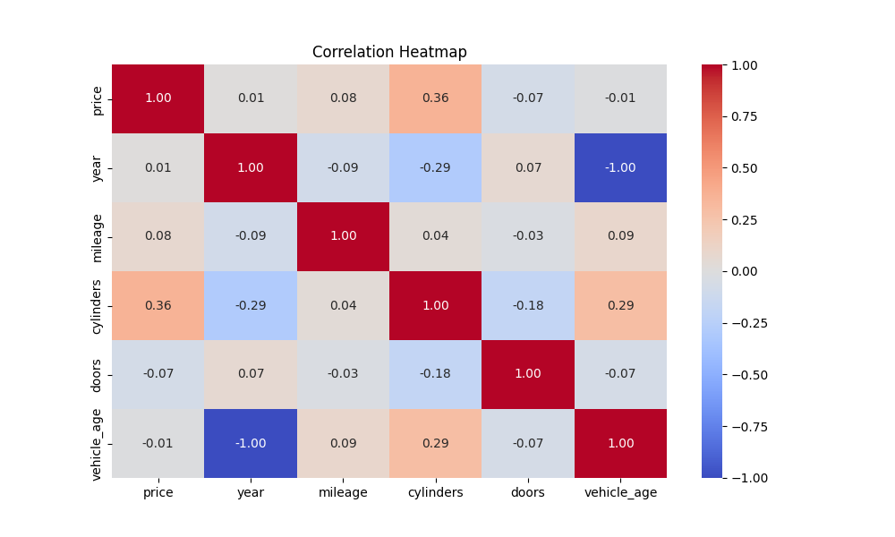
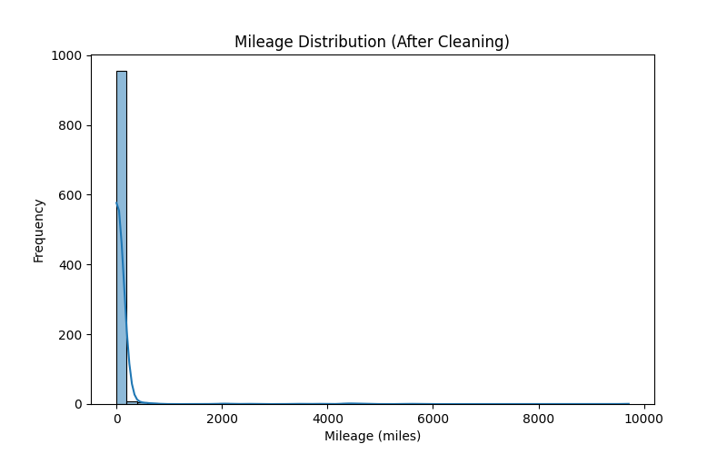
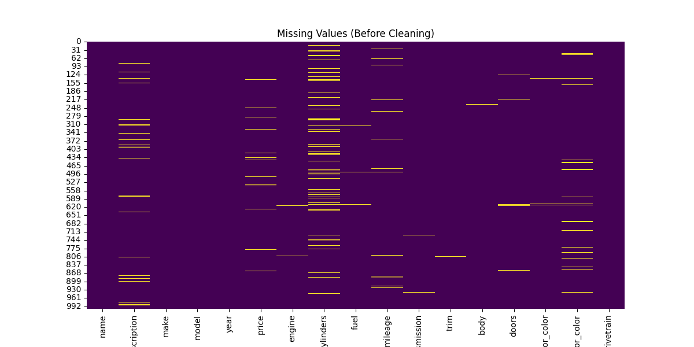
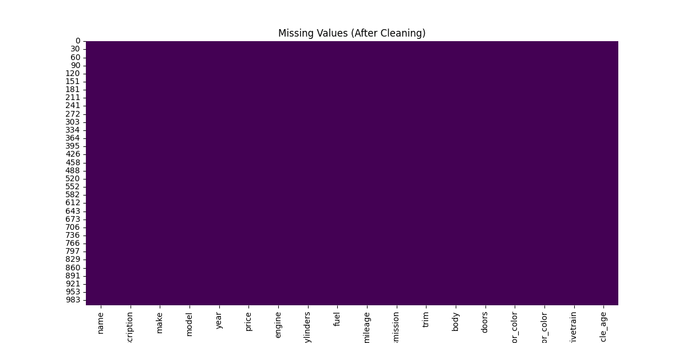
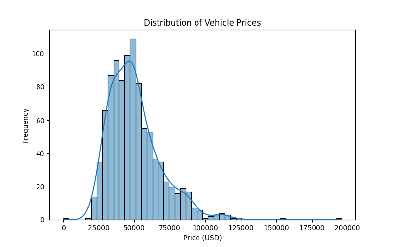
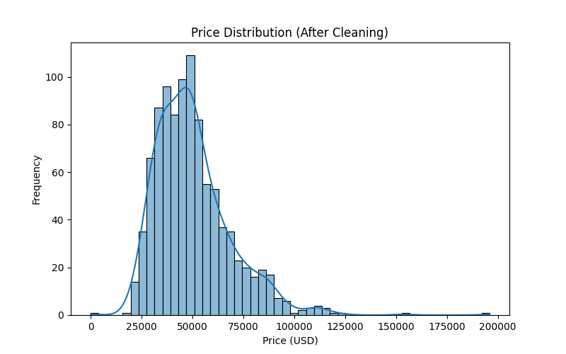
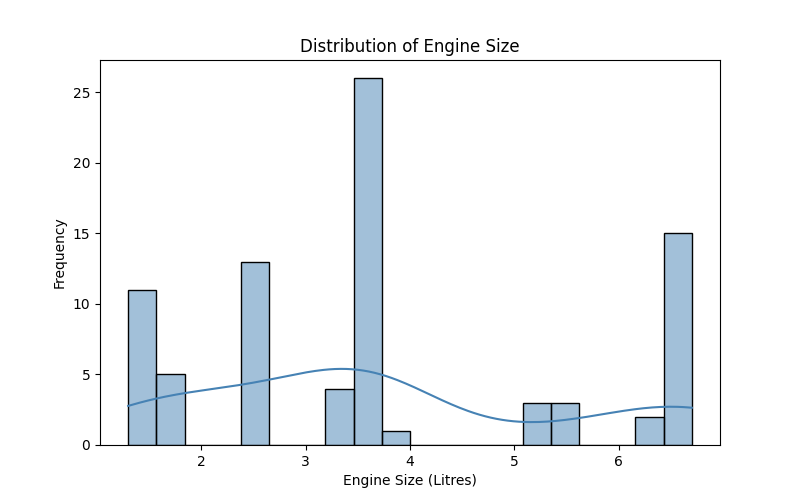
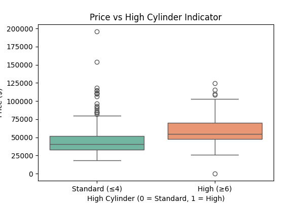
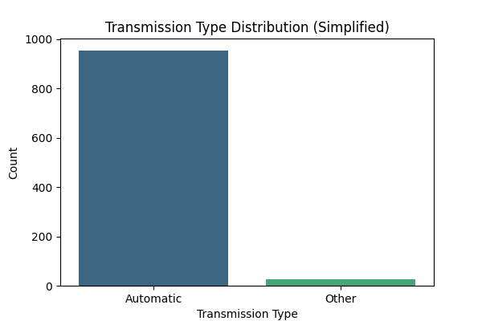

# 🚗 Vehicle Price Prediction

Machine Learning project for predicting used vehicle prices using vehicle specifications such as engine size, mileage, cylinders, transmission, and manufacturer.

The project performs data preprocessing, exploratory data analysis (EDA), model training, and evaluation using multiple regression models.

---

# 📌 Project Overview

Predicting vehicle prices is an important regression problem in automotive analytics. The goal is to estimate the market price of a vehicle based on its specifications and historical pricing patterns.

This project includes:

- Data cleaning and preprocessing
- Exploratory data analysis (EDA)
- Feature engineering
- Model training and evaluation
- Vehicle price prediction using trained models

---

# 📂 Repository Structure
vehicle-price-prediction
│
├── images
│ ├── correlation_heatmap.png
│ ├── mileage_distribution.png
│ ├── missing_before.png
│ ├── missing_after.png
│ ├── price_distribution.png
│ ├── price_distribution_cleaned.png
│ ├── engine_size_distribution.png
│ ├── price_vs_cylinder.png
│ ├── transmission_simple_distribution.png
│ ├── top_makes.png
│ ├── P5O1.png
│ └── P5O2.png
│
├── models
│ ├── LinearRegression.joblib
│ ├── RandomForest.joblib
│ ├── XGBoost.joblib
│ └── LightGBM.joblib
│
├── notebooks
│ └── 0_explore_dataset.ipynb
│
├── reports
│ ├── model_performance.png
│ └── model_results.csv
│
├── src
│ ├── app
│ ├── data
│ ├── features
│ ├── models
│ ├── predict.py
│ └── train.py
│
├── requirements.txt
├── .gitignore
└── README.md

---

# 📊 Exploratory Data Analysis

Understanding the dataset is critical before building machine learning models.

### Correlation Heatmap



### Mileage Distribution



### Missing Values (Before Cleaning)



### Missing Values (After Cleaning)



### Price Distribution



### Cleaned Price Distribution



### Engine Size Distribution



### Price vs Cylinders



### Transmission Type Distribution



---

# 🤖 Machine Learning Models

The following regression models were trained and compared:

### Linear Regression
Baseline regression model.

### Random Forest Regressor
Captures nonlinear relationships and interactions.

### XGBoost Regressor
Powerful gradient boosting algorithm optimized for structured data.

### LightGBM Regressor
Efficient gradient boosting framework designed for high performance.

Saved trained models:
models/
├── LinearRegression.joblib
├── RandomForest.joblib
├── XGBoost.joblib
└── LightGBM.joblib

---

# 📈 Model Evaluation

Model performance comparison results are stored in:
reports/model_performance.png
reports/model_results.csv

Metrics used for evaluation:

- R² Score
- Mean Absolute Error (MAE)
- Root Mean Squared Error (RMSE)

---

# ⚙️ Installation

Clone the repository:

```bash
git clone https://github.com/shrashtimittal/vehicle-price-prediction.git
cd vehicle-price-prediction
```
Install dependencies:
```bash
pip install -r requirements.txt
```

---

## ▶️ Running the Project

Train the model:

```bash
python src/train.py
```

Run predictions:
```bash
python src/predict.py
```

---

## 🚀 Future Improvements

- Deploy the model using **Streamlit**
- Improve feature engineering
- Add hyperparameter optimization
- Integrate model explainability using **SHAP**
- Build an interactive vehicle price prediction web app

---

## 👩‍💻 Author

**Shrashti Mittal**

AI • Machine Learning • Aerospace Systems • Quantum Computing
